# CryptoTrace (Problem 26182) — Complete Architecture Flow & Redesign Blueprint

> **Purpose:** Step-by-step blueprint to redesign the forensic architecture diagram. This incorporates all previously missing pitch points (**GNN Wallet Clustering**, **Multi-Chain Blockchain APIs**, **Mixers/DeFi Bridges**, **Case Database**, and **Live Fund Visualization Map**) while fixing broken loops and confusing branches in the original diagram.

---

## 1. What to Remove / Fix from the Old Diagram

| Original Element | Problem in Old Diagram | Fix in New Design |
| :--- | :--- | :--- |
| **`HOP tagged as VASP?`** | Had **TWO** diverging "Yes" arrows (one going up to Nearest VASP, one going right to Risk Score). | Make **ONE** "Yes" path: `HOP tagged as VASP?` &rarr; `Nearest VASP Identified` &rarr; `Confidence Scoring (90%+)` &rarr; `Risk Score (XGBoost + SHAP)`. |
| **`Nearest VASP` loopback** | Had an arrow pointing **backwards** into `HOP tagged as VASP?`. Highly confusing for evaluators. | **Remove backward arrow entirely.** Identifying the nearest VASP is a terminal/milestone match for that branch. |
| **`Max Hop Reached?`** | "Yes" went to `Mark for Review`, but the "No" label was floating in blank space with no arrow. | Connect **"No"** back to `Next HOP (Trip / Haircut Taint)` so traversal continues until Max Hop or a VASP/Choke point is found. |
| **Generic `Build Txn Graph`** | Fed only by SAHYOG API. SAHYOG only provides the initial victim complaint/suspect wallet address; it does NOT provide blockchain blocks/txs. | Feed `Build Txn Graph` with **both** SAHYOG (suspect seed) AND **Multi-Chain Blockchain APIs/RPCs** (Alchemy, QuickNode, Helius, Bitcoin Indexer). |
| **Binary VASP-or-Not Decision** | Only checked if a hop was a VASP or not. Ignored Mixers and Bridges (explicitly promised in pitch). | Replace the single binary check with a **Forensic Triaging Router**: checks for **(1) VASP**, **(2) Mixer / Tumbler**, **(3) DeFi Cross-Chain Bridge**, or **(4) Intermediate Unhosted Wallet**. |
| **Missing AI Innovation** | GNN Wallet Clustering was pitched as the headline "wow" factor ("AI links hidden wallets without direct transfer") but was missing. | Insert **GNN Wallet Clustering** immediately after `Build Txn Graph` and before Hop Traversal. |
| **Missing Storage & UI** | No Case Database or Interactive Live Map/Dashboard, leaving no home for reports or LEA interaction. | Add **Case Database (PostgreSQL / Relational + Graph Store)** and **Live Fund Visualization & LEA Dashboard**. |

---

## 2. The 5 Core Architectural Tiers (Canvas Layout)

Organize your canvas into **5 clear vertical columns (or logical tiers)** from Left to Right. This guarantees **zero crossed or spaghetti lines**:

```
[ TIER 1: Ingestion & Feeds ]  ──►  [ TIER 2: Graph & AI ]  ──►  [ TIER 3: TEE Engine ]  ──►  [ TIER 4: Data & UI ]  ──►  [ TIER 5: Enforcement ]
• SAHYOG mTLS API                  • Multi-Chain Tx Graph         • BFS Hop Traversal         • Case Database              • Court Notice (§91 BNSS)
• Multi-Chain APIs (EVM/Sol/BTC)   • GNN Wallet Clustering       • Triaging (VASP/Mixer/Br)  • Live Map Visualizer        • §63 BSA Certificate
• 3-Tier Intel Feeds (FIU/OFAC)      (Links hidden wallets)       • Risk Score (XGBoost)      • LEA Investigation Desk     • Freeze Request Callback
```

---

## 3. Detailed Component Breakdown

### Tier 1: Ingestion & Intelligence Inputs
1. **SAHYOG API (mTLS Ingestion):** Ingests NCRP 1930 scam complaints and initial suspect wallet addresses securely over mutual TLS.
2. **Multi-Chain Blockchain APIs / RPCs:** 
   - **Ethereum & EVMs (Arbitrum, Polygon, BSC):** Alchemy & QuickNode.
   - **Solana:** Helius RPC.
   - **Bitcoin UTXO:** Bitcoin Indexer / Mempool.space / Blockbook.
   - **Tron (TRC-20 USDT):** TronGrid API.
3. **3-Tier Intelligence Feeds:**
   - **FIU-IND VASP Master Registry:** 1,595+ verified exchange clusters & deposit hot wallets.
   - **OSINT & Sanctions:** OFAC SDN lists, GraphSense, Etherscan labels.
   - **Ransomware & Darknet Threat Intel:** Chainabuse, illicit syndicate blacklist.

### Tier 2: Graph Construction & AI Entity Resolution
4. **Build Multi-Chain Txn Graph:** Reconstructs parent-child transaction directed acyclic graphs (DAGs) across native coins and tokens.
5. **GNN Wallet Clustering (Headline AI Innovation):**
   - Uses Graph Neural Networks (GraphSAGE / Node2Vec / Temporal Graph Networks).
   - Clusters co-controlled hidden wallets **without direct transfer** (via gas funding trees, deposit sweep consolidation, and temporal behavioral patterns).
   - Resolves raw addresses into unified "Actor / Syndicate Entities".

### Tier 3: Trusted Execution Environment (TEE — Confidential Computing)
*Enclosed in a secure dotted boundary to guarantee cryptographic evidentiary integrity for court admissibility.*

6. **BFS Hop Traversal Engine (Trip / Haircut Taint Splitting):**
   - Traces fund flows hop-by-hop.
   - Applies Haircut / Proportional Taint splitting so washed funds cannot escape attribution.
7. **Forensic Triaging Router (The 4-Way Classifier):**
   - **Branch 1: Nearest VASP Match?** &rarr; Matches against FIU-IND / Master Registry.
     - &rarr; **Nearest VASP Identified** (Binance, CoinDCX, WazirX, etc.).
     - &rarr; **Attribution Confidence Scorer** (90%+ multi-factor score).
   - **Branch 2: Mixer / Tumbler Detected?** &rarr; Matches Tornado Cash, Sinbad, Railgun.
     - &rarr; Flags **Obfuscation Breakpoint** (+40 critical risk penalty; triggers de-mixing heuristics).
   - **Branch 3: DeFi Cross-Chain Bridge Detected?** &rarr; Matches ThorChain, Stargate, Portal, Wormhole.
     - &rarr; **Bridge Contract Resolver** decodes lock/mint events and dispatches target chain query to Multi-Chain APIs to continue trace across chains!
   - **Branch 4: Intermediate Unhosted Wallet (Peeling Chain / Pass-through):**
     - &rarr; Checks: **Max Hop Reached?** (e.g., Hop > 5 or Taint < 1%).
       - **If No:** &rarr; Feed into **Next HOP (Trip / Haircut)** &rarr; Loops back into BFS Traversal.
       - **If Yes:** &rarr; **Mark for Cold Storage / Manual Review**.
8. **Risk Scoring Engine (XGBoost + SHAP Explainability):**
   - Aggregates VASP proximity, mixer interaction, flight velocity, and transaction volume into an explainable 0–100 risk score.

### Tier 4: Persistence Layer & Forensic User Interface
9. **Case Database (PostgreSQL / Relational + Graph Store):**
   - Persists case metadata, suspect addresses, full hop trajectories, GNN entity clusters, risk scores, and forensic snapshots.
10. **Live Fund Visualization & LEA Case Dashboard:**
    - Interactive live graph canvas (Node-link & Sankey fund map).
    - Color-coded risk indicators (Red = Mixer, Amber = Unhosted, Green = VASP Choke Point).
    - One-click trigger for investigating officers (IOs) to initiate freezing.

### Tier 5: Statutory Enforcement & Asset Recovery
11. **Statutory Court Notice Engine:**
    - Formulates Section 91 BNSS (former 91 CrPC) lawful production & seizure orders.
    - Generates Section 63 BSA 2023 (former 65B IEA) electronic evidence certificate with SHA-256 cryptographic digest.
12. **SAHYOG Portal Callback:**
    - Pushes completed investigation dossiers, evidence certificates, and routing metadata back to the SAHYOG portal via mTLS.
13. **Automated VASP Freeze Request:**
    - Instant API / Nodal Officer dispatch to freeze the target exchange deposit account before the criminal can cash out into fiat.

---

## 4. Complete Arrow-by-Arrow Connection Table

| Step # | From (Source Node) | To (Destination Node) | Arrow Label / Condition | Purpose / Technical Meaning |
| :---: | :--- | :--- | :--- | :--- |
| **1** | SAHYOG API (mTLS) | Build Multi-Chain Txn Graph | `Suspect Wallet Seed` | Ingests reported fraud address / FIR complaint. |
| **2** | Multi-Chain Blockchain APIs | Build Multi-Chain Txn Graph | `Raw Blocks & Txns (EVM, BTC, SOL, TRON)` | Supplies real on-chain transaction data from Alchemy, Helius, Mempool, TronGrid. |
| **3** | Build Multi-Chain Txn Graph | GNN Wallet Clustering | `Raw Address Graph` | Sends transaction edges to AI clustering engine. |
| **4** | GNN Wallet Clustering | BFS Hop Traversal (TEE) | `Resolved Entity Clusters` | Feeds clustered entities into TEE traversal engine (links hidden wallets). |
| **5** | 3-Tier Intelligence Feeds | Forensic Triaging Router (TEE) | `Attribution Signatures` | Supplies FIU-IND registry, OFAC sanctions, and ransomware tags. |
| **6** | BFS Hop Traversal | Forensic Triaging Router | `Inspect Current Hop` | Checks current address against 4 operational typologies. |
| **7A** | Forensic Triaging Router | Nearest VASP Attribution | `Condition: Match == VASP` | Triggers nearest centralized exchange discovery. |
| **7B** | Forensic Triaging Router | Mixer / Tumbler Detector | `Condition: Match == Mixer` | Detects Tornado Cash/tumblers; applies obfuscation penalty. |
| **7C** | Forensic Triaging Router | DeFi Cross-Chain Bridge | `Condition: Match == Bridge` | Identifies cross-chain swaps (ThorChain/Stargate). |
| **7D** | Forensic Triaging Router | Max Hop Reached? | `Condition: Unhosted Private Wallet` | Intermediate peeling chain address evaluation. |
| **8** | DeFi Cross-Chain Bridge | Multi-Chain Blockchain APIs | `Fetch Destination Chain Tx` | Queries target chain RPC to hop across chains. |
| **9** | Mixer / Tumbler Detector | Risk Scoring (XGBoost + SHAP) | `Critical Obfuscation Flag` | Adds high-risk weighting to risk score. |
| **10** | Nearest VASP Attribution | High Confidence Scorer (90%+) | `Deposit / Sweep Match` | Validates multi-factor confidence criteria. |
| **11** | High Confidence Scorer | Risk Scoring (XGBoost + SHAP) | `Attribution Vector` | Provides VASP proximity & confidence features. |
| **12** | Max Hop Reached? | Next HOP (Trip / Haircut) | `Condition: No` | Traversal continues to next hop with taint split. |
| **13** | Next HOP (Trip / Haircut) | BFS Hop Traversal | `Recurse Next Hop` | Advances traversal loop to inspect downstream wallets. |
| **14** | Max Hop Reached? | Mark for Manual Review | `Condition: Yes` | Path reaches horizon (e.g. >5 hops) without VASP hit. |
| **15** | Risk Scoring (XGBoost + SHAP) | Case Database | `Store Forensic Dossier` | Persists all scores, graph states, and entity clusters. |
| **16** | Case Database | Live Fund Visualization Map | `Graph Stream & Analytics` | Renders interactive real-time visual map for LEA. |
| **17** | Case Database | Statutory Court Notice Engine | `Approved Case Dossier` | Prepopulates Section 91 BNSS order and Section 63 BSA certificate. |
| **18** | Statutory Court Notice Engine | SAHYOG Portal Callback | `mTLS Webhook Callback` | Returns lawful notice & evidence back to SAHYOG. |
| **19** | Statutory Court Notice Engine | Automated VASP Freeze Request | `Instant Nodal Freeze Notice` | Sends urgent freeze order to exchange grievance officer. |

---

## 5. Visual Mermaid Flowchart (Copy & Paste Ready)

```mermaid
flowchart LR
    %% =======================================================
    %% STYLING DEFINITIONS
    %% =======================================================
    classDef inputStyle fill:#EBF3FF,stroke:#2979FF,stroke-width:2px,color:#0D47A1;
    classDef aiStyle fill:#F3E8FF,stroke:#7C3AED,stroke-width:2px,color:#4C1D95;
    classDef teeStyle fill:#EFF6FF,stroke:#0284C7,stroke-width:2px,stroke-dasharray: 5 5,color:#0369A1;
    classDef decisionStyle fill:#FEF3C7,stroke:#D97706,stroke-width:2px,color:#78350F;
    classDef vaspStyle fill:#ECFDF5,stroke:#059669,stroke-width:2px,color:#064E3B;
    classDef alertStyle fill:#FEE2E2,stroke:#DC2626,stroke-width:2px,color:#7F1D1D;
    classDef bridgeStyle fill:#FEF9C3,stroke:#CA8A04,stroke-width:2px,color:#713F12;
    classDef dbStyle fill:#F1F5F9,stroke:#475569,stroke-width:2px,color:#0F172A;
    classDef legalStyle fill:#E0E7FF,stroke:#4338CA,stroke-width:2px,color:#1E1B4B;

    %% =======================================================
    %% TIER 1: INGESTION & DATA SOURCES
    %% =======================================================
    subgraph TIER1["1. Ingestion & Multi-Chain Data Feeds"]
        direction TB
        SAHYOG["💻 SAHYOG Portal API\n(mTLS Ingestion)"]:::inputStyle
        
        subgraph MC_APIS["Multi-Chain APIs & Indexers"]
            direction TB
            EVM_API["Alchemy / QuickNode\n(ETH, BSC, Polygon)"]
            SOL_API["Helius RPC\n(Solana)"]
            BTC_API["Mempool / Blockbook\n(Bitcoin UTXO)"]
            TRON_API["TronGrid API\n(TRC-20 USDT)"]
        end
        style MC_APIS fill:#F8FAFC,stroke:#64748B,stroke-width:1.5px;
        
        subgraph INTEL_FEEDS["3-Tier Threat Intel"]
            direction TB
            FIU["FIU-IND VASP Registry\n(1,595+ Clusters)"]
            OSINT["OSINT & Sanctions\n(OFAC SDN / GraphSense)"]
            RANSOM["Ransomware & Darknet Feeds\n(Chainabuse / Blacklists)"]
        end
        style INTEL_FEEDS fill:#F8FAFC,stroke:#64748B,stroke-width:1.5px;
    end

    %% =======================================================
    %% TIER 2: GRAPH BUILDING & GNN CLUSTERING
    %% =======================================================
    subgraph TIER2["2. Graph Building & AI Resolution"]
        direction TB
        BUILD_GRAPH["🕸️ Build Multi-Chain\nTxn Graph"]:::aiStyle
        GNN["🧠 GNN Wallet Clustering\n(AI Links Hidden Wallets\nWithout Direct Transfer)"]:::aiStyle
    end

    %% =======================================================
    %% TIER 3: TRUSTED EXECUTION ENVIRONMENT (TEE)
    %% =======================================================
    subgraph TIER3["3. Confidential Execution Environment (TEE)"]
        direction TB
        BFS["🔄 BFS Hop Traversal\n(Taint: Haircut & Trip Model)"]:::teeStyle
        
        ROUTER{"🔍 Hop Typology\nClassifier?"}:::decisionStyle
        
        VASP_MATCH["🏦 Nearest VASP Attribution\n(Exchange Deposit / Hot Wallet)"]:::vaspStyle
        VASP_CONF["🛡️ Attribution Confidence\n(Score: 90%+)"]:::vaspStyle
        
        MIXER["🌪️ Mixer / Tumbler Detector\n(Tornado Cash / Obfuscation)"]:::alertStyle
        BRIDGE["🌉 DeFi Bridge Resolver\n(ThorChain, Stargate, Cross-Chain)"]:::bridgeStyle
        
        MAX_HOP{"⚠️ Max Hop\nReached?"}:::decisionStyle
        NEXT_HOP["🔀 Next HOP\n(Taint Decay Calculation)"]:::teeStyle
        REVIEW["🚩 Mark for Review\n(Cold Storage / Leaf Node)"]:::alertStyle

        RISK_ENG["📊 Risk Scoring Engine\n(XGBoost + SHAP Explainability)"]:::aiStyle
    end

    %% =======================================================
    %% TIER 4: PERSISTENCE & VISUALIZATION
    %% =======================================================
    subgraph TIER4["4. Persistence & Interactive Case Desk"]
        direction TB
        CASE_DB[("🗄️ Case Database\n(PostgreSQL + Graph Store\nForensic Dossiers & Audit Log)")]:::dbStyle
        LIVE_MAP["🗺️ Live Fund Flow Map\n& LEA Investigation Dashboard"]:::inputStyle
    end

    %% =======================================================
    %% TIER 5: STATUTORY ENFORCEMENT
    %% =======================================================
    subgraph TIER5["5. Legal Enforcement & Freeze Automation"]
        direction TB
        COURT_NOTICE["⚖️ Statutory Court Notice\n(Section 91 BNSS & Sec 63 BSA)"]:::legalStyle
        CALLBACK["📄 SAHYOG Callback\n(mTLS Automated Report)"]:::legalStyle
        FREEZE["❄️ Automated Freeze Request\n(Direct to VASP Nodal Officer)"]:::vaspStyle
    end

    %% =======================================================
    %% CONNECTIONS & FLOW
    %% =======================================================
    SAHYOG -->|"Suspect Seed"| BUILD_GRAPH
    MC_APIS -->|"Blocks & Transfers"| BUILD_GRAPH
    BUILD_GRAPH -->|"Raw Txn Edges"| GNN
    GNN -->|"Enriched Entity Clusters"| BFS
    
    INTEL_FEEDS -.->|"Attribution Metadata"| ROUTER
    
    BFS --> ROUTER
    
    %% Branch 1: VASP Hit
    ROUTER -->|"Match: VASP"| VASP_MATCH
    VASP_MATCH --> VASP_CONF
    VASP_CONF -->|"VASP Confidence Feature"| RISK_ENG
    
    %% Branch 2: Mixer Hit
    ROUTER -->|"Match: Mixer"| MIXER
    MIXER -->|"Obfuscation Risk Penalty"| RISK_ENG
    
    %% Branch 3: Bridge Hit
    ROUTER -->|"Match: Bridge"| BRIDGE
    BRIDGE -.->|"Fetch Dest Chain Tx"| MC_APIS
    
    %% Branch 4: Unhosted intermediate
    ROUTER -->|"Unhosted Wallet"| MAX_HOP
    MAX_HOP -->|"No"| NEXT_HOP
    NEXT_HOP --> BFS
    MAX_HOP -->|"Yes"| REVIEW
    
    %% Output to Persistence & UI
    RISK_ENG -->|"Store Dossier & State"| CASE_DB
    REVIEW -->|"Flagged Entity"| CASE_DB
    CASE_DB <-->|"Live Graph Stream & Actions"| LIVE_MAP
    
    %% Output to Legal Enforcement
    CASE_DB -->|"Approved Case Evidence"| COURT_NOTICE
    COURT_NOTICE --> CALLBACK
    COURT_NOTICE --> FREEZE
```



---

## 6. How to Recreate This in Your Diagram Tool (Canva, PowerPoint, Draw.io, or Eraser)

1. **Draw 5 Vertical Column Guides / Swimlanes:**
   - Col 1: `Data Inputs`
   - Col 2: `Graph & AI Clustering`
   - Col 3: `Secure TEE Engine` (enclose in a light blue shaded box with a dashed blue border and a lock icon)
   - Col 4: `Database & Live Map`
   - Col 5: `Legal Action & Freeze`

2. **Colors to Use:**
   - **Inputs (SAHYOG & Multi-Chain):** Slate Blue (`#2979FF` / `#EBF3FF`)
   - **AI Innovations (GNN & XGBoost):** Royal Purple (`#7C3AED` / `#F3E8FF`) — *makes the GNN pop out as your signature innovation!*
   - **Decisions / Diamonds:** Amber Orange (`#D97706` / `#FEF3C7`)
   - **VASP / Success Nodes:** Emerald Green (`#059669` / `#ECFDF5`)
   - **Mixers / Warnings:** Ruby Red (`#DC2626` / `#FEE2E2`)
   - **DeFi Bridges:** Warm Gold / Mustard (`#CA8A04` / `#FEF9C3`)
   - **Legal Notices:** Indigo Navy (`#4338CA` / `#E0E7FF`)

3. **Key Narrative Points for Judges During Your Presentation:**
   - **Point 1 (Multi-Chain Reality):** *"We don't just query one chain. We ingest EVM, Bitcoin, Solana, and Tron through dedicated multi-chain indexers."*
   - **Point 2 (GNN Wow Factor):** *"Criminals don't always transfer funds directly. Our Graph Neural Network clusters co-controlled wallets through topological embeddings and gas funding patterns."*
   - **Point 3 (DeFi & Mixer Handling):** *"When funds hit Tornado Cash or a cross-chain bridge like ThorChain, our forensic router doesn't give up. It flags the mixer obfuscation and resolves the bridge smart contract to resume tracing on the destination chain."*
   - **Point 4 (Admissibility & Speed):** *"All computation runs inside a hardware-isolated TEE, writing to an immutable Case Database, outputting court-ready Section 91 BNSS notices and Section 63 BSA certificates directly to exchange Nodal Officers."*
