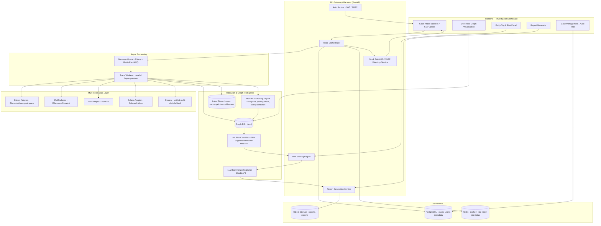

# Automated VASP Attribution Engine for SAHYOG — Solution Blueprint

**Problem Statement 26182** — Automated Attribution of Unknown Cryptocurrency Wallets to Nearest VASPs through Blockchain Intelligence APIs

---

## 1. What You Are Actually Building

Strip away the government jargon and this is: **a multi-chain fund-flow tracer that starts at a suspect wallet, walks the transaction graph hop-by-hop, and stops at the first address it can confidently label as an exchange/custodial deposit wallet — then produces a report an investigator can act on.**

That's a well-understood problem class (this is what Chainalysis Reactor / Elliptic Lens / Arkham do commercially). For a hackathon you are not out-building them — you are building a **working, demonstrable slice** of the same pipeline, on 2-3 real chains, with a real graph database, real public attribution data, and a polished investigator-facing UI. That combination (not any single feature) is what reads as "technically deep" to judges.

### Final Deliverable
1. A **web dashboard** (LEA-facing) where an investigator pastes/uploads a suspect wallet address (or a CSV of many, mimicking a SAHYOG case upload).
2. The system **traces outgoing/incoming flows** across hops on one or more chains, live, showing a **graph visualization** of the path.
3. Each node in the path is **auto-tagged** (Exchange / Mixer / DeFi Bridge / Unknown / Sanctioned) with a **confidence score**, using a combination of: known-address datasets, heuristic clustering, and an LLM-assisted narrative summarizer.
4. The engine surfaces the **nearest attributable VASP(s)** with a ranked confidence list and the exact hop path to it.
5. One click generates a **PDF/DOCX "investigation-ready" report** (this is literally requested in the problem statement) with the trace graph, entity tags, risk score, and a suggested SAHYOG-style disclosure request draft.
6. A **case dashboard** showing multiple investigations, risk heatmap, and audit trail (who traced what, when) — this is what makes it feel "SAHYOG-integrated" rather than a toy script.
7. A mocked **"Send disclosure request to VASP"** action (you will not have real SAHYOG API access — building this as a clearly-labeled simulated integration with a mock VASP directory is the right hackathon move, and judges expect this).

---

## 2. End-to-End System Architecture

### Component Breakdown (what each piece *does*)

| Component | Responsibility | Why it's needed |
|---|---|---|
| **Multi-Chain Data Layer** | Normalizes address/tx data from BTC, ETH/EVM, Tron, Solana into one internal schema | Real-world crypto crime spans chains (Tron for USDT scams, ETH for DeFi, BTC for ransomware) — supporting 3+ chains genuinely is your biggest "wow" factor |
| **Trace Orchestrator** | Given a seed wallet, BFS/DFS expands the transaction graph hop by hop, calling chain adapters, applying stop conditions | This *is* the core IP of the project |
| **Heuristic Clustering Engine** | Applies known blockchain-forensics heuristics: common-input-ownership (BTC), peeling-chain detection, sweep-transaction detection, deposit-address fan-in patterns | This is what makes it "intelligence" rather than "an Etherscan wrapper" — big differentiator for judges |
| **Label Store** | Known exchange hot wallets, mixer addresses, sanctioned addresses (OFAC SDN list), darknet market wallets | Ground truth for tagging — without this you can't attribute anything |
| **Graph DB (Neo4j)** | Stores wallets as nodes, transactions as edges, supports path queries (`shortestPath`, `allShortestPaths`) | This is the natural data structure for "nearest VASP" — literally a shortest-path graph problem |
| **Risk Classifier** | Scores wallets/paths using engineered features (fan-in/out ratio, mixer-hop count, velocity, path depth) — a simple GNN or XGBoost model trained on labeled data is enough | Adds a genuine ML component, not just rule-based logic |
| **LLM Summarizer** | Turns the raw trace graph + tags into a natural-language investigation narrative and drafts the disclosure request text | Fast way to make the report look "investigation-ready"; also great live demo moment |
| **Report Generator** | Produces PDF/DOCX with the graph image, entity table, confidence scores, recommended VASP contact | Explicitly requested in the problem statement — don't skip this |
| **Mock SAHYOG/VASP Directory** | A seeded table of "VASP name → jurisdiction → known deposit clusters → contact template" | Simulates the SAHYOG integration without needing real government API access |
| **Case Management + Audit Trail** | Postgres-backed case records, who ran what trace, timestamps | Shows you understand this is a *chain-of-custody* sensitive government tool, not a toy |

### Data Flow (single trace, plain English)
1. Investigator submits wallet `0xABC...` → job queued.
2. Worker fetches all outgoing transactions for `0xABC` from the right chain adapter.
3. Each destination address is checked against the Label Store — if it's a known exchange, **stop, tag, done**.
4. If unknown, the clustering engine checks: is this a peeling chain? A sweep pattern? A mixer signature? Score each candidate hop.
5. Expand to the next hop (bounded depth, e.g. max 6 hops, configurable) — repeat, writing nodes/edges into Neo4j as it goes so the UI can stream partial results.
6. Once a labeled VASP is hit (or depth/budget exhausted), stop expansion on that branch.
7. Risk classifier scores the whole path; LLM produces the narrative; report generator renders the PDF.
8. Everything is written back to the case record for audit.

---

## 3. Recommended Tech Stack

### Frontend
| Choice | Why | Essential? |
|---|---|---|
| **React + TypeScript + Vite** | Standard, fast dev loop, huge ecosystem | Essential |
| **Tailwind CSS + shadcn/ui** | Fast to build a clean, credible "government dashboard" look without custom CSS effort | Essential |
| **React Flow** or **Cytoscape.js** | Purpose-built for interactive node-edge graph visualization — this is your money shot on stage | Essential (React Flow is easier; Cytoscape has better graph-algorithm ergonomics for large graphs) |
| **Recharts** | Risk dashboards, volume-over-time charts | Essential |
| **Mapbox GL / deck.gl** | Optional: geographic view if you tag VASP jurisdictions by country | Optional |

### Backend
| Choice | Why | Essential? |
|---|---|---|
| **Python + FastAPI** | Async-native, auto OpenAPI docs, plays perfectly with the ML/data-science stack you'll need for clustering and risk scoring | Essential |
| **Celery + Redis (or RabbitMQ)** | Wallet tracing is I/O-bound and can take seconds-to-minutes across many hops/APIs — must be async/background, with live progress pushed to the UI (WebSocket/SSE) | Essential |
| **WebSocket (FastAPI native) or Socket.IO** | Stream partial trace results to the graph UI as hops resolve — much better demo than a spinner | Highly recommended |

### AI/ML
| Choice | Why | Essential? |
|---|---|---|
| **Claude API (Sonnet)** | Generate the investigator-facing narrative report, draft the disclosure-request text, explain *why* a wallet got a given risk score in plain English | Essential — this is your "AI" story for judges |
| **NetworkX** | In-Python graph algorithms for smaller subgraphs (shortest path, centrality) before/alongside Neo4j | Essential |
| **XGBoost / LightGBM** | Lightweight, fast-to-train risk classifier on engineered wallet features (train on OFAC-sanctioned + known-exchange + known-mixer addresses as labels) | Recommended — real ML, trains in minutes on a laptop |
| **PyTorch Geometric (GNN)** | *Stretch goal*: a graph neural network for wallet classification instead of hand-engineered features — genuinely impressive if you have time, but XGBoost is the safe baseline | Optional/stretch |
| **scikit-learn** | Feature engineering, evaluation metrics, simple clustering (DBSCAN for address clustering) | Essential |

### Blockchain & Network Analysis Libraries
| Choice | Why | Essential? |
|---|---|---|
| **web3.py** | Direct EVM chain reads (Ethereum, BNB, Polygon) when needed beyond Etherscan API limits | Essential |
| **bitcoinlib** or direct **Blockchair/mempool.space REST** | BTC UTXO parsing, common-input-ownership heuristic (the classic Meiklejohn et al. clustering heuristic) | Essential for BTC support |
| **TronGrid / TronPy** | Tron chain reads — critical because **Tron/USDT is the dominant chain for pig-butchering and romance scams**, which is exactly the crime type this problem statement targets | Essential if covering Tron (strongly recommend you do — highest real-world relevance to Indian cyber fraud cases) |
| **Solana `solana-py` / Solscan API** | Solana support | Optional (nice-to-have for "multi-chain" breadth) |
| **NetworkX / igraph** | Graph algorithms, centrality, community detection for clustering | Essential |
| **Neo4j Graph Data Science library** | Built-in `shortestPath`, PageRank, community detection (Louvain) directly in the graph DB — great for the "nearest VASP" query itself | Essential |

### Databases
| Choice | Role | Essential? |
|---|---|---|
| **Neo4j (Community Edition, free)** | Core transaction graph — wallets as nodes, txns as edges. `MATCH shortestPath((suspect)-[:SENT_TO*1..6]->(vasp:Exchange))` is *literally* your core feature as one Cypher query | Essential |
| **PostgreSQL** | Cases, users, audit logs, VASP directory, structured metadata | Essential |
| **Redis** | Celery broker, API response caching (blockchain API calls are rate-limited and slow — cache aggressively), session store | Essential |
| **Elasticsearch / OpenSearch** | Optional: full-text/fuzzy search across case notes, wallet tags, VASP names at scale | Optional — nice for the "large-scale" narrative, skip if time-constrained |

### Search
- **OpenSearch (self-hosted, free)** if you want the "search engine" checkbox for judges — index case reports and tagged entities for fast investigator search. Optional but cheap to add given Postgres full-text search already covers 80% of this for a hackathon.

### Deployment & Hosting
| Choice | Why | Essential? |
|---|---|---|
| **Docker + docker-compose** | Reproducible local + demo environment: FastAPI, Neo4j, Postgres, Redis, worker, frontend all as services | Essential |
| **Render / Railway / Fly.io** | Fastest path to a live demo URL without fighting Kubernetes; all have free/cheap tiers with Postgres+Redis add-ons | Essential for a live judged demo |
| **Vercel** for frontend (if decoupled) | Trivial CI/CD for React | Optional |
| **Kubernetes / Helm** | Only mention in your architecture slide as "production scaling path" — do **not** actually build this for a hackathon | Skip building; mention in slides |

### Monitoring & Logging
| Choice | Why | Essential? |
|---|---|---|
| **structlog / Python logging + Grafana Loki (optional)** | Basic structured logs are enough | Minimal essential |
| **Prometheus + Grafana** | Nice "enterprise readiness" demo panel (API latency, trace jobs/sec) if you have a spare afternoon | Optional, good visual impact |
| **Sentry (free tier)** | Error tracking during dev/demo | Optional |

### Authentication & Security
| Choice | Why | Essential? |
|---|---|---|
| **JWT-based auth (FastAPI-Users or custom)** | LEA users need login; role-based access (investigator vs admin) matters for the narrative ("chain of custody") | Essential |
| **RBAC (investigator / supervisor / admin roles)** | Reflects real LEA hierarchy, easy win for "government-appropriate design" | Recommended |
| **Encrypted case data at rest (Postgres column encryption or pgcrypto)** | Sensitive investigation data — mention/implement minimally, emphasize in slides | Recommended to at least implement pgcrypto on wallet/case tables |
| **Audit log table (immutable, append-only)** | Every trace/report action logged with user + timestamp | Essential — cheap to build, high narrative value |

---

## 4. APIs, Datasets, and Tools

### Blockchain Data / Attribution APIs

| Tool | Type | Free tier? | Role | Essential? |
|---|---|---|---|---|
| **Etherscan / BscScan / Polygonscan APIs (unified Etherscan V2 multichain API)** | Free (rate-limited) | Yes | Core EVM transaction history + verified contract data | **Essential** |
| **Blockchair API** | Freemium | Yes (limited) | BTC/multi-chain explorer-grade queries, some address tagging | Essential for BTC |
| **mempool.space API** | Free, open | Yes, generous | BTC transaction/UTXO data, no key needed | Essential for BTC |
| **TronGrid API** | Free | Yes | Tron chain reads — critical for USDT-TRC20 fraud tracing | Essential |
| **Bitquery (GraphQL)** <cite index="3-1">provides bulk historical queries, aggregation, address labelling and multi-hop fund tracing across a schema shared with 40+ chains</cite> | Freemium | Yes (dev tier) | Your best single fallback/aggregator across many chains via one GraphQL schema — huge time-saver vs. writing 6 separate adapters | **Highly recommended as primary aggregator**, with native APIs as backup |
| **Covalent / GoldRush API** | Freemium | Yes | Unified multi-chain balances/transactions across 100+ chains, single API key | Optional alternative/backup to Bitquery |
| **Chainalysis, Elliptic, TRM Labs (commercial)** | Paid, enterprise-only, requires sales contact | No public self-serve tier | The "real" commercial VASP-attribution/entity-labeling tools this problem statement is implicitly modeling | **Not usable for a hackathon** — no self-serve access; mention them in your slides as "the production-grade upgrade path" but do not plan to integrate them |
| **Arkham Intelligence** | Freemium (web + limited API) | Public entity-tagged data via web/API | <cite index="2-1">Arkham's "Ultra" engine aggregates on-chain and off-chain data to classify wallets into entity clusters like exchanges, funds, and known bad actors</cite>, <cite index="2-1">currently covering 12 chains including Bitcoin, Ethereum, Solana, BNB Chain, Tron, and Polygon</cite> | Good source to **manually pull known-exchange address lists** to seed your Label Store — check current API terms before automating calls | Optional but valuable for seed data |
| **OFAC SDN Crypto Address List (sanctions)** | Free, public, official | Yes | Ground-truth "sanctioned wallet" labels — real government data, instantly credible to judges | **Essential, easy win** |
| **GraphSense / GraphSense TagPacks (open source, from academic/Europol-linked project)** | Free, open-source | Yes | Open dataset of tagged addresses (exchanges, services) plus an open clustering methodology you can cite academically | **Essential** — this is the single best free open-source foundation for your Label Store and clustering heuristics |
| **CryptoScamDB / Chainabuse (community-reported scam addresses)** | Free, open | Yes | Community-sourced scam/fraud wallet reports — good for demo scenarios and risk-scoring labels | Recommended |

### LLM APIs
| Tool | Role | Essential? |
|---|---|---|
| **Claude API (Sonnet)** | Report narrative generation, plain-English risk explanation, disclosure-request drafting | Essential |
| **Claude API (Haiku)** | Cheaper/faster calls for simpler tagging suggestions if you want to reduce cost during heavy demo usage | Optional cost optimization |

### Geolocation / Visualization
| Tool | Role | Essential? |
|---|---|---|
| **Neo4j Bloom (free with Community, limited) or your own React Flow layer** | Interactive graph exploration | React Flow essential; Bloom optional bonus for judges who like clicking around raw Neo4j |
| **Mapbox / react-simple-maps** | Map VASP jurisdiction by country (e.g., "nearest VASP is registered in Singapore") | Optional, nice narrative touch for cross-border angle in the problem statement |

### Cost-conscious tip for the hackathon
Everything above marked "Free/Freemium" can run entirely on free-tier keys for a 2-3 day hackathon build+demo. Budget maybe $0-20 total in Claude API usage for demo purposes. Do **not** pay for Chainalysis/Elliptic/TRM access — it's not available self-serve anyway, and judges know that; simulating their category with open data (GraphSense, OFAC, Arkham public labels) is the expected and correct approach.

---

## 5. Hackathon-Realistic Scope (MVP Cut Line)

Given a typical 24-48 hour build window, prioritize in this order:

1. **Must have (Day 1):** Chain adapters for BTC + one EVM chain (Ethereum) + Tron. Neo4j graph ingestion. Basic BFS trace with depth limit. Label Store seeded from OFAC + GraphSense TagPacks.
2. **Must have (Day 1-2):** React dashboard with case intake, live graph visualization (React Flow), basic risk scoring (rule-based: mixer hop = high risk, direct exchange = resolved).
3. **Should have (Day 2):** Celery async pipeline with WebSocket progress streaming, XGBoost risk classifier trained on your labeled seed data, Claude-generated narrative report + PDF export.
4. **Nice to have (Day 2-3, if ahead of schedule):** Solana support, mocked SAHYOG disclosure-request workflow, Prometheus/Grafana panel, GNN-based risk model, cross-chain bridge detection heuristics.
5. **Demo-only shortcuts that are fine to take:** Pre-warm the cache/demo dataset with 3-5 real, publicly documented scam/ransomware wallet addresses (e.g., publicly reported ransomware payment addresses) so your live demo doesn't depend on API rate limits or the exact luck of a random hop path. This is standard hackathon practice and judges expect a curated demo path plus a "try your own address" fallback.

---

## 6. Why This Design Will Score Well

- **Real government data** (OFAC) + **real open-source forensics methodology** (GraphSense/common-input-ownership heuristics) gives you defensible technical grounding, not hand-waving.
- **Graph database + shortest-path query** is the technically "correct" data structure for "nearest VASP" — judges with any CS background will recognize this immediately as the right design choice, not over-engineering.
- **Multi-chain (BTC + EVM + Tron)** directly matches real Indian cybercrime patterns (Tron/USDT for pig-butchering scams is currently the dominant rail), showing domain understanding beyond the literal problem PDF.
- **Async pipeline + live graph streaming** demonstrates real software-engineering maturity (not a synchronous script) without requiring you to actually build Kubernetes-scale infra.
- **LLM-generated investigator report** is your differentiated "AI" story, cleanly separated from the graph/ML core — it should never be the only intelligence in the system (a report-writer, not the fraud detector).
- **Clearly labeled mock SAHYOG integration** signals engineering maturity — you're not pretending you have access you don't have, but the *interface contract* is designed correctly for real integration later.

---

## 7. What NOT to Build

- Do not attempt to break address anonymization/deanonymize privacy coins (Monero) — out of scope, ethically and technically infeasible in a hackathon, and not what this problem statement is asking for.
- Do not try to cover all 6+ chains listed in the problem statement at production depth — 3 real chains done well beats 6 chains done shallowly.
- Do not build real Kubernetes/multi-region deployment — describe it in your architecture slide as the scaling path, keep the actual demo on docker-compose + a single cheap cloud instance.
- Do not attempt to integrate a real Chainalysis/Elliptic paid API — it's not self-serve accessible and isn't expected for a hackathon submission.
